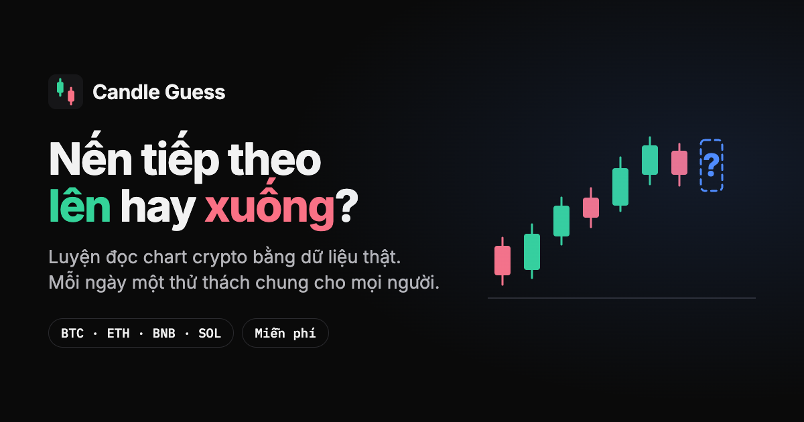

# Candle Guess

Game luyện đọc chart crypto bằng dữ liệu giá thật: nhìn chart, đoán nến tiếp theo **lên hay xuống**,
biết ngay mình đúng hay sai và sai ở đâu.

**Chơi thử:** <https://candles-oj1q.onrender.com> — bản demo trên gói free, lần mở đầu sau một
khoảng lặng có thể chậm vài giây.



## Có gì

| | |
|---|---|
| **Đoán nến** | Chart thật, 5 lượt đoán mỗi chart, đồng hồ 20 giây. Sai thì được gợi ý dần: volume → đường trung bình → tên mẫu nến. Hết chart thì lộ ngày giờ thật và toàn cảnh trước/sau |
| **Thử thách mỗi ngày** | Một chart chung cho mọi người, một lượt, chia sẻ kết quả kiểu Wordle, chơi lại 60 ngày trước. Kèm một câu đố mẫu nến mỗi ngày |
| **Trực tiếp** | Cả cộng đồng cùng đoán cây nến 1h đang chạy, khoá lệnh 8 phút trước khi đóng |
| **Giao dịch demo** | Tiền ảo trên giá thật, 5 khung thời gian, MA/RSI, phí giao dịch |
| **Học** | Thư viện mẫu nến và mẫu hình kỹ thuật (có "tìm ví dụ thật" trên dữ liệu đã lưu), tâm lý giao dịch, blog |
| **Giữ chân** | Chuỗi ngày chơi, 9 huy hiệu, bảng xếp hạng, hồ sơ |
| **Quản trị** | `/admin.html`: tổng quan, retention, người chơi, live round, preview thử thách ngày mai, CMS blog, thư viện ảnh |

Đăng nhập bằng ví (Reown AppKit, có cả email và Google). Không đăng nhập vẫn chơi được, chỉ không
lưu kết quả.

## Kiến trúc

```
OKX / Binance ──► CandleSyncService (backfill + mỗi giờ) ──► Postgres
                                                                │
                 RoundSelectionService — cửa sổ ngẫu nhiên, hoặc theo ngày cho thử thách
                                                                │
                 RoundTokenService — ký JWT chứa đáp án; server không giữ trạng thái vòng
                                                                │
                 REST API ◄──► frontend tĩnh (HTML + JS thuần, chart SVG tự vẽ)
```

Vài quyết định đáng chú ý (giải thích đầy đủ trong [CLAUDE.md](CLAUDE.md)):

- **Đáp án không bao giờ xuống client trước khi đoán.** Nó nằm trong token ký, thời gian trả lời
  đo từ lúc server phát token, và "một lượt mỗi ngày" là unique constraint trong database.
- **Không lưu con số nào suy ra được.** Streak, huy hiệu, số dư demo, retention đều tính lại từ
  lịch sử, nên không bao giờ lệch khỏi thực tế.
- **Frontend không framework.** Mỗi file một IIFE; chỉ ví và trình soạn blog là bundle (Vite), và
  cả hai chỉ tải khi cần.

## Stack

Java 25 · Spring Boot 4.1 · Spring Security · PostgreSQL 16 · Flyway · Jackson 3 · jjwt ·
JS thuần · Vite (2 bundle) · Reown AppKit · Tiptap · Cloudinary · GitHub Actions ·
Render + Neon.

## Chạy ở máy

Cần Java 25+ và Docker.

```bash
docker compose up -d
```

```bash
./mvnw spring-boot:run
```

Mở <http://localhost:8080>. Lần chạy đầu Flyway dựng schema và app backfill nến từ Binance
(khoảng 40 nghìn nến mỗi cặp, 15–30 giây); đợi dòng `Synced N candles for …` trong log.

Postgres chạy ở cổng `5544`, cố ý tránh `5432`/`5433`.

## Cấu hình chính

Mọi thứ nằm dưới `candles.*` trong [application.yaml](src/main/resources/application.yaml),
ghi đè bằng biến môi trường.

| Biến | Mặc định | Ý nghĩa |
|---|---|---|
| `DB_URL`, `DB_USERNAME`, `DB_PASSWORD` | Postgres local | Kết nối database |
| `AUTH_JWT_SECRET`, `ROUND_TOKEN_SECRET` | giá trị dev | Khoá ký. Ngoài profile `dev`, app **từ chối khởi động** nếu vẫn là giá trị mặc định |
| `ADMIN_WALLETS` | rỗng | Ví có quyền admin, cách nhau dấu phẩy. Rỗng thì trang admin đóng hoàn toàn |
| `CANDLES_PRICE_SOURCE` | `binance` | `binance` hoặc `okx` |
| `CANDLES_BACKFILL_START` | `2022-01-01T00:00:00Z` | Lấy nến từ ngày nào |
| `ANALYTICS_GOATCOUNTER` | rỗng | Mã site GoatCounter để đo phễu (ví dụ `candle-guess`, không phải URL). Rỗng thì không đếm gì |
| `CLOUDINARY_*` | rỗng | Upload ảnh cho blog |

## Kiểm thử

```bash
./mvnw test
```

Hơn 260 test, gồm các luồng đầy đủ trên Postgres thật. CI chạy trên mọi push; test tự tạo dữ liệu
nến nên không cần gọi sàn.

## Sao lưu

`.github/workflows/backup.yml` chạy mỗi đêm: dump database, kiểm tra các bảng không thể lấy lại
(tài khoản, lượt đoán, live, demo) đều có dữ liệu, mã hoá AES-256 rồi lưu làm artifact 30 ngày.
Cần hai secret `NEON_BACKUP_URL` và `BACKUP_PASSPHRASE`; thiếu thì job tự bỏ qua.

Khôi phục vào một database **trống** (trên Neon: một branch mới), cần Docker:

```bash
DATABASE_URL='postgresql://…' BACKUP_PASSPHRASE='…' scripts/restore-db.sh candles-….dump.gpg
```

## Tài liệu

| | |
|---|---|
| [CLAUDE.md](CLAUDE.md) | Kiến trúc và lý do đằng sau từng quyết định |
| [docs/MVP_PLAN.md](docs/MVP_PLAN.md) | Review tổng thể và các MVP tiếp theo |
| [docs/DEPLOY_PLAN.md](docs/DEPLOY_PLAN.md) | Deploy Render + Neon, và vì sao bản demo lấy giá từ OKX |
| [docs/SPEC.md](docs/SPEC.md) | Spec và khảo sát đối thủ ban đầu |
| [docs/ADMIN_PLAN.md](docs/ADMIN_PLAN.md), [docs/LEADERBOARD_PLAN.md](docs/LEADERBOARD_PLAN.md) | Kế hoạch từng mảng |
